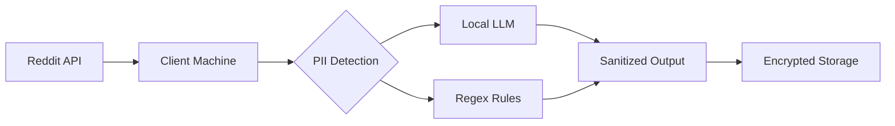

# 🔴 reddacted · AI-Powered Reddit Privacy Suite

[](https://pypi.org/project/reddacted/)
[](https://opensource.org/licenses/BSD-3-Clause)
[](https://github.com/psf/black)
[](https://github.com/yourusername/reddacted)

> **Your digital alias caretaker** · *For aging engineers who care about their future political careers* 🏛️


## Table of Contents
- [✨ Features](#-features)
- [🚀 Quick Start](#-quick-start)
- [🔧 Configuration](#-configuration)
- [📖 Documentation](#-documentation)
- [🤖 Privacy Tech](#-privacy-tech)
- [💡 FAQ](#-faq)
- [🤝 Contributing](#-contributing)

## ✨ Features
▰▰▰▰▰▰▰▰▰▰▰▰▰▰▰▰▰▰▰▰▰▰▰▰▰▰▰▰▰▰

- 🛡️ **PII Detection** - Find potential personal info leaks in comments using AI/Regex
- 🤫 **Sentiment Analysis** - Understand the emotional tone of your Reddit history
- 🔒 **Zero-Trust Architecture** - Client-side execution only, no data leaves your machine
- ⚡ **Self-Host Ready** - Run locally with Ollama/Mistral or cloud providers
- 📊 **Smart Cleanup** - Preserve valuable contributions while removing risky content
- 🕵️ **Stealth Mode** - Appear active while scrubbing sensitive history


- **Users**:  Get the sentiment based on the most recent comments submitted

## 🚀 Quick Start

```bash
# Install with pipx (recommended)
pipx install reddacted

# Basic analysis (no auth)
reddacted user yourusername --output-file analysis.md

# Full authenticated analysis
reddacted user yourusername \
  --enable-auth \
  --output-file sensitive-analysis.md

# Subreddit analysis
reddacted listing programming python \
  --output-file python-sentiment.csv
```

## 🔧 Configuration

```bash
# Authenticate with Reddit API (recommended)
export REDDIT_CLIENT_ID="your-client-id"
export REDDIT_CLIENT_SECRET="your-client-secret"
export REDDIT_USERNAME="your-username"
export REDDIT_PASSWORD="your-password"

# For local AI processing
export OLLAMA_API_BASE="http://localhost:11434"
```

Key features:
- Automatic dependency handling
- Single-command operation
- Built-in help: `reddacted --help`

## Troubleshooting ##

If you get "command not found" after installation:
1. Check Python scripts directory is in your PATH:
```bash
# Typical Linux/Mac location
export PATH="$HOME/.local/bin:$PATH"

# Typical Windows location
set PATH=%APPDATA%\Python\Python311\Scripts;%PATH%
```
2. Verify installation location:
```bash
pip show reddacted
```

## Authentication ##

Before running an commands, in order to ensure that we are able to use the reddit API consecutively, we should authenticate with reddit. In order to do this the following is required:

- **Reddit Account**: You can sign up at [https://www.reddit.com/account/register/](https://www.reddit.com/account/register/)
- **Reddit App**: Click on the **are you a developer? create an app...** button at the bottom of [https://www.reddit.com/prefs/apps](https://www.reddit.com/prefs/apps)
- **Reddit API Access**: You can request access at [https://www.reddit.com/wiki/api/](https://www.reddit.com/wiki/api/)

Once the above is complete, we should set the following environment variables:

```bash
$ export REDDIT_USERNAME=your-username
$ export REDDIT_PASSWORD=your-password
$ export REDDIT_CLIENT_ID=your-client-id
$ export REDDIT_CLIENT_SECRET=your-client-secret
```

Now when running the CLI, all requests will be authenticated.

## Development ##

It is recommended that you first create a python virtual environment to not overwrite pip dependencies in your system. See [virtualenvs](http://docs.python-guide.org/en/latest/dev/virtualenvs/):

1. Clone this repository

2. Change directory to application path

3. Install application requirements

```bash
$ pip install -r requirements.txt
```

4. Install required **nltk** packages

```bash
$ python -m nltk.downloader vader_lexicon
```

5. Make changes to the code

6. Install the application from source code

```bash
$ sudo python setup.py install
```

Now you can go ahead and test the new features you have implemented! Contributions welcome, feel free to contribute by:

- Opening an Issue
- Creating a PR with additions/fixes

## Testing ##

I have included a number of unit tests to validate the application. In order to run the tests, simply perform the following:

1. Install pytest

```bash
$ pip install pytest
```

2. Clone this repository

3. Change directory to application path

4. Install application requirements

```bash
$ pip install -r requirements.txt
```

5. Install required **nltk** packages

```bash
$ python -m nltk.downloader vader_lexicon
```

6. Install application test requirements

```bash
$ pip install -r test-requirements.txt
```

7. Run Unit tests

```bash
$ pytest tests
```

## Common Exceptions ##

### too many requests ###

If you're unauthenticated, reddit has relatively low rate limits for it's API. Either authenticate against your account, or just wait a sec and  try again.

### the page you requested does not exist ###

Simply a 404, which means that the provided username does not point to a valid page.

## 🤖 Privacy Tech Stack



## 💡 FAQ
### ❓ How accurate is the PII detection?
We use a defense-in-depth approach combining:
- **AI Detection**: GPT-4/3.5-turbo, Mistral, or local LLMs
- **Pattern Matching**: 50+ regex rules for common PII formats
- **Context Analysis**: Sentence structure evaluation

### 🌐 What LLMs are supported?
```bash
# Local Models
ollama run mistral
ollama run llama3

# Cloud Providers
export OPENAI_API_KEY="your-key"
export ANTHROPIC_API_KEY="your-key"
```

### 🔐 Can I trust this with my data?
```bash
# Full offline mode
reddacted user yourusername \
  --local \
  --model ollama/mistral
```

> **Pro Tip**: Always review changes before executing deletions!
